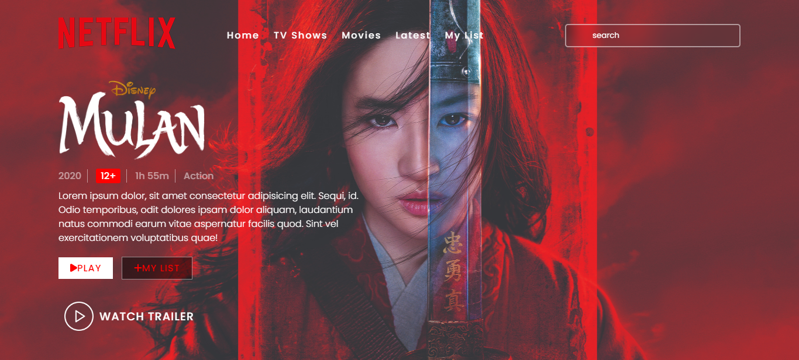

<h1 align="center">:file_cabinet: Filme Mulan</h1>

## :memo: Descrição
* Foi criada uma pagina com o filme da Mulan, simulando o site da Netflix.
Na pagina foram colocadas algumas informações como a classificação indicativa, ano de lançamento e gênero do filme.

## :books: Funcionalidades
* Na pagina é possivel assistir ao trailer do filme, clicando no player.

## :wrench: Tecnologias utilizadas
* JavaScript;
* HTML
* CSS
* Git e  Github

🔗[Clique aqui para acessar](https://roodrigues98.github.io/Netflix-page/)

## :dart: Status do projeto

* Finalizado

## 📧 Contato
* estefani.rodrigues.26@gmail.com
* Linkedin: (https://www.linkedin.com/in/estefani-rodrigues98/)

